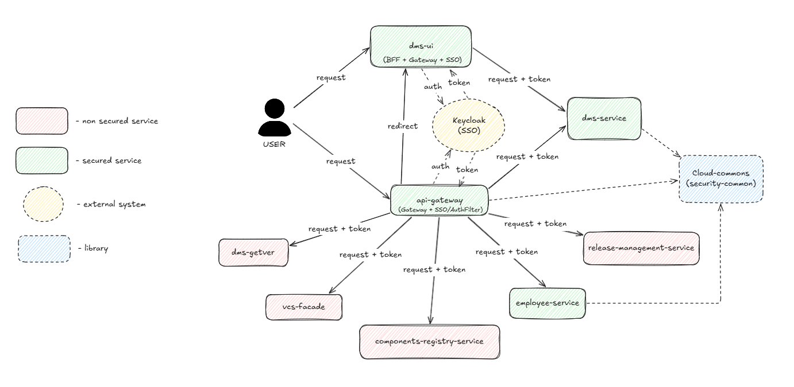
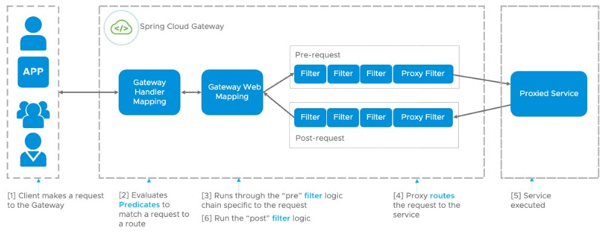

# Internal structure of DMS-UI, Api-Gateway services and Cloud-Commons Library

## Table of Contents

1. `DMS-UI` service
   1. Versions
   2. Описание
   3. За что отвечает frontend
   4. За что отвечает backend
   5. User flow c примерами кода
2. `Api-Gateway` service
   1. Versions
   2. Описание
   3. Что за что отвечает
   4.  User flow c примерами кода
3. `Cloud-Commons` library
   1. Version
   2. Описание
   3. Как устроена логика
   4. Как библиотека подключается и используется в других сервисах
4. Q&A
   1. Почему когда выполняем логаут в dms-ui, то в api-gateway тоже происходит логаут, и наоборот



## 1. DMS-UI service

Repository: `https://github.com/octopusden/octopus-dms-ui`

### 1.1 Versions

- JDK 21
- Kotlin 1.9.22
- Gradle 8.6
- Spring Boot 3.2.2
- Spring Cloud 2023.0.1

### 1.2 Описание

`dms-ui` - представляет из себя Spring Boot (WebFlux) приложение, выполняющее роль BFF, отвечающее за OAuth2-аутентификацию через SSO keycloak, отдачу frontend статики, проксирование запросов к `dms-service`.

На `dms-ui` нет ни JPA, ни JDBC. DMS-UI с БД не работает вообще, только через HTTP к dms-service.

### 1.3 За что отвечает frontend

- не управляет токенами напрямую, а только отображение и отправка запросов;
- `/auth/me` при старте. Получает объект пользователя с ролями (и вычисленными правами) чтобы понимать что отображать, а что нет.

### За что отвечает backend

- поднимает OAuth2-аутентификацию через keycloak (SSO).
- реверс прокси на `dms-service` через `spring-cloud-gateway`. Маршрутизация `/auth/**` и `/rest/api/**` на `dms-service`. Фильтр `TokenRelay` пробрасывает access token из `OAuth2AuthorizedClient`.
- отдает статику фронта (`WebConfig.class`).
- `/actuator/*` отдает метрики. Также есть Health‑checks (`spring-boot-starter-actuator` + `micrometer-registry-prometheus`).
- разрешает доступ к `/static/**`, `/bundle.js`, `/main.css`, `/favicon.ico`, `/logout`, `/actuator/**`,  и запрещает (требует аутентификацию к) `/`, `/index.html`, `/auth/**` и `/rest/api/**`. Дизейблит CSRF (`SecurityConfig.class`).

`SecurityConfig.class`

```kotlin
.authorizeExchange { exchanges ->
    exchanges
        // разрешаем доступ без авторизации до
        .pathMatchers(
            "/static/**",
            "/bundle.js",
            "/main.css",
            "/favicon.ico",
            "/logout",
            "/actuator/**",
        ).permitAll()
        // требуем авторизацию до этих ресурсов
        .pathMatchers(
            "/",
            "/index.html",
            "/auth/**",
            "/rest/api/**",
        ).authenticated()
        // для любых ругих запросов требуем авторизацию
        .anyExchange().authenticated()
}
// Говорим Security что наше приложение клиент, с авторизацией на keycloak (см. конфигу ниже)
// withDefaults потому что все необходимое уже задано в конфиге
.oauth2Login(Customizer.withDefaults())
// Обрабатываем вызов /logout
.logout { logout ->
    logout
        // При успешной обработке и локальной чистке пользователя
        .logoutSuccessHandler { webFilterExchange, _ ->
            val response = webFilterExchange.exchange.response
            response.statusCode = HttpStatus.FOUND
            // Редиректим на logoutUrl и удаляем SSO сессию
            response.headers.location = URI.create(logoutUrl)
            Mono.empty()
        }
}
// Отключаем Cross-Site Request Forgery (защиту от межсайтового доступа)
.csrf { it.disable() }
```

### 1.5 User flow c примерами кода

Пользователь заходит на `dms-ui` и сразу попадает в webflux `SecurityWebFilterChain`, а именно в `SecurityConfig.securityFilterChain()`. При попытке доступа к защищенному ресурсу происходит редирект на SSO keycloak, где необходимо ввести свои credentials.

Примеры конфиг настройки keycloak взятые с `service-config`, которые пробрасываются в `dms-ui`:

`application.yaml`

```yaml
auth-server:
 url: https://<sso URL>
 realm: f1
```

В этой конфиге указаны заранее определенные переменные auth-server-а, которые указывают на путь до SSO, а также realm `f1` (изолированная область в которой настраиваются пользователи, клиенты, роли и т.д.). Эти данные будут использоваться как в других конфигах в качестве переменной, так и в библиотеке `cloud-commons`.

Далее:

`dms-ui.yaml`

```yaml
spring:
 security:
   oauth2:
     client:
       provider: 
         // описание сервера авторизации keycloak
         keycloak:
		   // ручка для получения и обновления токенов (access, refresh)
           token-uri: ${auth-server.url}/realms/${auth-server.realm}/protocol/openid-connect/token
	       // куда перенаправляем при доступе к защищенному ресурсу
           authorization-uri: ${auth-server.url}/realms/${auth-server.realm}/protocol/openid-connect/auth             
           // ручка получения информации о пользователе по access_token            
           userinfo-uri: ${auth-server.url}/realms/${auth-server.realm}/protocol/openid-connect/userinfo 
           // какое поле считаем username-ом
           user-name-attribute: preferred_username
           // используется для проверки подписи и валидности JWT
           jwk-set-uri: ${auth-server.url}/realms/${auth-server.realm}/protocol/openid-connect/certs
```

В этой конфиге описывается сам сервер keycloak с которым будем работать.

`dms-ui.yaml`

```yaml
spring:
 security:
   oauth2:
     client:
       registration:
         keycloak:
           # обязательный скоуп для OIDC (id_token, userinfo)
           scope: openid
           # связываем конфигу с верхней (provider)
           provider: keycloak
           # настраивает OAuth2 flow
           authorization-grant-type: authorization_code
           # куда возвращаем после авторизации
           redirect-uri: "{baseUrl}/login/oauth2/code/{registrationId}"
```

В этой описывается клиент, который будет с ним работать.

После логина в keycloak сохраняется сессия и в браузере появляются соответствующие cookies. Происходит редирект на `dms-ui` (туда откуда произошел запрос на авторизацию) с возвращением authorization code (параметр `authorization-grant-type`), который используется для отправки на endpoint keycloak и получения токенов (параметр `token-uri`). Access token и refresh token сохраняются в `OAuth2AuthorizedClientRepozitory`, а в `SecurityContext` хранится `Authentication`.

Сам токен имеет определенное время жизни, по истечению которого будет повторно вызван endpoint на получение нового токена или редирект на переадресацию, в случае если сессия больше не действительна.

Все проксируемые дальнейшие запросы к `dms-service` теперь будут идти с bearer token благодаря настройке `TokenRelay`:

`dms-ui.yaml`

```yaml
spring:
 cloud:
   gateway:
     default-filters:
       - TokenRelay
```

Настройка gateway Prod:

`dms-ui-cloud-prod.yaml`

```yaml
spring:
  cloud:
    gateway:
      routes:
        - id: dms-service
          uri: http://dms-production.f1.svc.cluster.local:8080
          predicates:
            - Path=/auth/**,/rest/api/**
```

Настройка gateway QA:

`dms-ui-cloud-qa.yaml`

```yaml
spring:
  cloud:
    gateway:
      routes:
        - id: dms-service
          uri: http://dms-test.f1.svc.cluster.local:8080
          predicates:
            - Path=/auth/**,/rest/api/**
```

То есть:

`dms-ui -> dms-service + token`

Если путь это статика (доступная без авторизации) то секьюрность пропускает и запрос доходит до `WebConfig`/`ResourceHandler`. `WebConfig` отдаёт что надо из `classpath:/static`.

`WebConfig.class`

```kotlin
@Configuration
open class WebConfig : WebFluxConfigurer {
    override fun addResourceHandlers(registry: ResourceHandlerRegistry) {
        registry.addResourceHandler(
            "/static/**",
            "/bundle.js",
            "/main.css",
            "/favicon.ico",
            "/index.html",
        ).addResourceLocations("classpath:/static/")
    }
}
```

В случае логаута произойдет удаление сессии keycloak и редирект на prod/qa base url используется в `securityFilterChain`:

`dms-ui.yaml`

```yaml
auth-server:
  logout-url: ${auth-server.url}/realms/${auth-server.realm}/protocol/openid-connect/logout?redirect_uri=${dms-ui.hostname}
```

Настройка редиректа на Prod:

`dms-ui-cloud-prod.yaml`

```yaml
dms-ui.hostname: <host_name>
```

Настройка редиректа на QA:

`dms-ui-cloud-qa.yaml`

```yaml
dms-ui.hostname: <host_name>
```

## 2. Api-Gateway service

Repository: `https://github.com/octopusden/octopus-api-gateway`

### 2.1 Versions

- JDK 21
- Kotlin 1.9.22
- Gradle 8.6
- Spring Boot 3.2.2
- Spring Cloud 2023.0.1
- Cloud Commons 2.0.14

### 2.2 Описание

`api-gateway` - это шлюз для других микросервисов, таких как `components-registry-service`, `dms-service`, `dms-getver`, `employee-service`, `release-management-service` и `vcs-facade`, построенный на Spring Cloud Gateway.

### 2.3 Что за что отвечает

- маршрутизацию запросов;
- изолирует доступ к другим сервисам;
- управление аутентификацией и авторизацией;
- обработку security (OAuth2 с Keycloak);
- преобразование Basic Auth в JWT-токены.

Сервис обеспечивает единый вход в систему, балансировку, фильтры (например, `TokenRelay` для передачи токенов) и мониторинг через Actuator. Он не хранит данные, а только проксирует трафик, добавляя security-слой.

Общая архитектура: Spring Reactive (`WebFlux`), с фильтрами для security + routing. Также содержит библиотеку `octopus-cloud-commons` (о ней ниже).

Сервис содержит главную страницу `index.html', куда происходит перенаправления при дефолтных GET-запросах, откуда можно удобно перенаправиться на любой из проксируемых сервисов из списка, указанного выше:

`GatewayController.class`

```kotlin
@Controller
class GatewayController(gatewayProperties: GatewayProperties) {
    // Запрашивает gateway роуты которые указали в конфигурационных настройках api-gateway-cloud-<test/prod>.yaml для отображения и перехода
    private val routeIds = gatewayProperties.routes.filter { route ->
        route.predicates.any { predicate ->
            predicate.name == "Path" && predicate.args.values.any { it == "/${route.id}/**" }
        }
    }.map { it.id }.sorted()

    // Возвращаем view с подставленными данными из model и кнопками перехода на разные сервисов из routeIds
    @GetMapping
    fun index(model: Model, @AuthenticationPrincipal oauth2User: OAuth2User): String {
        model.addAttribute("userName", oauth2User.name)
        model.addAttribute("routeIds", routeIds)
        return "index"
    }
}
```

### 2.4 User flow c примерами кода

Если пользователь заходит на gateway site, то ему необходимо будет авторизоваться в keycloak, о чем нам говорят настройки Security:

`SecurityConfig.class`

```kotlin
http.authorizeExchange { exchanges: AuthorizeExchangeSpec ->
    // требование авторизоваться при запросе ресурса "/"
    exchanges.pathMatchers("/").authenticated()
    // доступ до всего остального разрешаем
    exchanges.anyExchange().permitAll()
}
```

После авторизации получается токен, который сохраняет в `Authentication` (отличный от `dms-ui`) `SecurityContex` `Api-Gateway` и происходит переадресация на запрашиваемую страницу.

Даже сами конфигурации похожи с тем что было описано в `dms-ui`:

`api-gateway.yaml`

```yaml
// Все это тоже что и у dms-ui
spring:
  cloud:
    gateway:
      default-filters:
        - TokenRelay
  security:
    oauth2:
      client:
        provider:
          keycloak:
            token-uri: ${auth-server.url}/realms/${auth-server.realm}/protocol/openid-connect/token
            authorization-uri: ${auth-server.url}/realms/${auth-server.realm}/protocol/openid-connect/auth
            userinfo-uri: ${auth-server.url}/realms/${auth-server.realm}/protocol/openid-connect/userinfo
            user-name-attribute: preferred_username
            jwk-set-uri: ${auth-server.url}/realms/${auth-server.realm}/protocol/openid-connect/certs
        registration:
          keycloak:
            scope: openid
            provider: keycloak
            authorization-grant-type: authorization_code
            redirect-uri: "{baseUrl}/login/oauth2/code/{registrationId}"
```

Роутинг запросов также похож на `dms-ui`, за исключением добавления сервисов, достучаться до которых по архитектуре не может `dms-ui` (совместил конфиги prod и qa в одну для наглядности):

`api-gateway-cloud-prod/qa.yaml`

```yaml
spring:
  cloud:
    gateway:
      default-filters:
        - TokenRelay
      routes:
        - id: components-registry-service
          uri: http://components-registry-service-<production/test>.f1.svc.cluster.local:8080
          predicates:
            - Path=/components-registry-service/**
          // Убираем "/components-registry-service/" из запроса к сервису для правильной обработки
          filters:
            - StripPrefix=1

        - id: dms-getver
          uri: http://dms-getver-<production/test>.f1.svc.cluster.local:8080
          predicates:
            - Path=/dms-getver/**
          filters:
            - StripPrefix=1

        - id: dms-service
          uri: http://dms-<production/test>.f1.svc.cluster.local:8080
          predicates:
            - Path=/dms-service/**
          filters:
            - StripPrefix=1

        # Осталось для обратной совместимости когда dms-service 
        # содержал dms-ui и доступ до него был через api-gateway
        - id: dms-ui-redirect
          uri: no://op
          predicates:
            - Path=/dms-ui/**
          filters:
            - RedirectTo=302, <host_name>

        - id: employee-service
          uri: http://employee-service-<production/test>.f1.svc.cluster.local:8080
          predicates:
            - Path=/employee-service/**
          filters:
            - StripPrefix=1

        - id: vcs-facade
          uri: http://vcs-facade-<production/test>.f1.svc.cluster.local:8080
          predicates:
            - Path=/vcs-facade/**
          filters:
            - StripPrefix=1

        - id: release-management-service
          uri: http://release-management-service-<production/test>.f1.svc.cluster.local:8080
          predicates:
            - Path=/release-management-service/**
          filters:
            - StripPrefix=1
```

В случае логаута также произойдет удаление сессии keycloak, `Authentication` из `SecurityContext` и редирект на prod/qa:

`SecurityConfig.class`

```kotlin
@Configuration
@EnableWebFluxSecurity
@Import(AuthServerClient::class) // Включаем интеграцию с cloud-commons (об этом ниже)
open class SecurityConfig(
    // Из пропертей разных профилей тянем то, куда логаутим (см. ниже)
    @Value("\${auth-server.logout-url}")
    private val logoutUrl: String
) {
    @Bean
    open fun springSecurityFilterChain(http: ServerHttpSecurity): SecurityWebFilterChain {
        /* ... */
        .logout { logout ->
            logout.logoutSuccessHandler { exchange, _ ->
                exchange.exchange.response.apply {
                    statusCode = HttpStatus.FOUND
                    // Добавляем action при успешном логауте
                    headers.add(HttpHeaders.LOCATION, logoutUrl)
                    // Чистим cookie
                    cookies.remove("JSESSIONID")
                }
                exchange.exchange.session.flatMap { it.invalidate() }
            }
        }
        /* ... */
    }
}
```

`api-gateway.yaml`

```yaml
auth-server:
  # Отличие - указание переменной api-gateway.hostname идет без https и указаны 
  # в профилях уровня application, а не api-gateway
  logout-url: ${auth-server.url}/realms/${auth-server.realm}/protocol/openid-connect/logout?redirect_uri=https://${api-gateway.hostname}
```

Настройка редиректа на Prod:

`application-cloud-prod.yaml`

```yaml
api-gateway:
  hostname: <host_name>
```

Настройка редиректа на QA:

`application-cloud-qa.yaml`

```yaml
api-gateway:
  hostname: <host_name>
```

В случае если запрос к `api-gateway` осуществляется с Basic Auth Token (`user:passwd`).

Пример:

`curl example`

```bash
curl -u user:passwd https://<host_name>/dms-service/rest/api/3/components/monit-unit/minor-versions
```

То используется фильтр написанный в `BasicAuthFilter.class`, который преобразует этот токен в долгоживущий Offline Bearer Token и подменит Header и также прокинет его через `TokenRelay`.

`BasicAuthFilter.class`

```kotlin
@Component
class BasicAuthFilter(private val authServerClient: AuthServerClient) : GlobalFilter { }
```

Он внедряется в общий cloud gateway filter. Наглядная схема (просто для понимания)



`BasicAuthFilter.class`

```kotlin
override fun filter(
    exchange: ServerWebExchange,
    chain: GatewayFilterChain
): Mono<Void> {
    // внедряемся в цепочку request запросов cloud gateway
    exchange.request
        // конкретно тут нам нужен хэдер Authorization, который мы будем подменять
        .headers["Authorization"]
        ?.let { authHeader ->
            log.debug("Request has Authorization header")
            if (authHeader.size == 1) {
                authHeader.firstOrNull()
                    ?.let { header ->
                        // Обрабатываем только токен Basic Auth, если Bearer то не трогаем, он и так тот что надо
                        if (header.startsWith("Basic")) {
                            log.debug("Authorization header has 'Basic' prefix, processing authentication")
                            val basicAuth = header.replace("Basic ", "")
                            // Это рассмотрим ниже
                            translateBasicAuthToBearerAccessToken(basicAuth)
                                ?.let { accessToken ->
                                    log.info("Basic Auth to JWT translation success")
                                    exchange.request
                                        .mutate()
                                        // Модифицируем и подменяем его
                                        .header("Authorization", "Bearer $accessToken")
                                        .build()
                                } ?: kotlin.run {
                                    log.debug("There is no JWT authentication, skipping...")
                                }
                        }    
                    }
            }
        }
    // Связываем цепочку с последующими фильтрами, чтобы не нарушать целостность работы gateway фильтров
    return chain.filter(exchange)
    // Никакого response processing нет
}
```

Метод `translateBasicAuthToBearerAccessToken` соответсвенно содержит логику перевода токена из Basic в Bearer:

`BasicAuthFilter.class`

```kotlin
private fun translateBasicAuthToBearerAccessToken(basicAuth: String): String? {
    // Декодируем токен получаем user:passwd
    val authString = Base64.getDecoder()
        .decode(basicAuth)
        .decodeToString()
    // Получаем Pair()
    val (username, password) = authString
        .split(":")

    // Генерим оффлайн JWT
    val offlineJwt = authTokens[authString]
        ?.let { existedOfflineJwt ->
            val currentTime = Instant.now()
                .plusSeconds(60)
            // Если токен не истек , то ок
            if (existedOfflineJwt.accessTokenExpDate > currentTime) {
                log.debug("Access token for '$username' is actual, using it")
                existedOfflineJwt
            } else {
                log.debug("Access token for '$username' is expired")
                // Если истек то пользуемся refresh токеном
                if (existedOfflineJwt.refreshTokenExpDate > currentTime) {
                    log.debug("Refresh token for '$username' is actual, refreshing access token")
                    refreshToken(existedOfflineJwt)
                } else {
                   // Иначе ничего) 
                    null
                    log.debug("Refresh token for '$username' is expired")
                }
            }
        } ?: kotlin.run {
            log.debug("Generating new offline token for '$username'")
            generateToken(username, password)
        }
     
    // Сохраняем/пересохраняем токены в мапе
    return offlineJwt?.let { offlineJwtValue ->
        authTokens[authString] = offlineJwtValue
        offlineJwtValue.accessToken
    }
}


companion object {
    // Мапа ассоциирующая credentials пользователя с сущностью токенов (о ней ниже)
    private val authTokens = ConcurrentHashMap<String, OfflineJwt>()
}
```

Сами методы генерации и обновления токенов просто используют методы библиотеки `Cloud-commons` передают пользователя/пароль и рефреш токен соответственно.

Все это добавляет системе гибкости. Offline Token живёт независимо от SSO-сессии.

## 3. Cloud-Commons library

Repository: `https://github.com/octopusden/octopus-cloud-commons`

### 3.1 Version

- JDK 21
- Kotlin 1.9.22
- Gradle 8.9
- Spring Boot 3.2.2
- Spring Cloud 2023.0.1

### 3.2 Описание

`Cloud-commons` - это библиотека, которая в которой содержатся инструменты для интеграции с Keycloak, обработки JWT-токенов, извлечения user info (роли, группы), проверки permissions и базовой конфигурации security в Spring Boot.

Она нужна чтобы не дублировать security логику в каждом отдельном сервисе. Внедряется как зависимость. Нет бизнес-логики - чисто security утилиты.

### 3.3 Как устроена логика

Бин, с которого мы начнем, используется в других сервисах, подключающих данную библиотеку - `CloudCommonWebSecurityConfig`.

`CloudCommonWebSecurityConfig.class`

```kotlin
// Включаем Security Filter Chain, каждый HTTP запрос теперь проходит через security фильтры
@EnableWebSecurity
// Активирует разные pre и post проверки (будет использоваться в сервисах которые импортируют либу и навешивают на конкретные контроллеры)
@EnableMethodSecurity(prePostEnabled = true, securedEnabled = true)
// О SecurityProperties ниже
@EnableConfigurationProperties(SecurityProperties::class)
abstract class CloudCommonWebSecurityConfig(
    // О AuthServerClient ниже
    private val authServerClient: AuthServerClient,
    protected val securityProperties: SecurityProperties
)
```

В нем из интересного нам, кроме дополнительных функций по типу вывода ролей и их разрешений после создания самого бина, содержится наш любимый `securityFilterChain`:

`CloudCommonWebSecurityConfig.class`

```kotlin
@Bean
open fun securityFilterChain(http: HttpSecurity): SecurityFilterChain {
    http
        .authorizeHttpRequests { auth ->
            auth
                // Разришаем следующие ресурсы для тех кто импортит нашу либу
                .requestMatchers(
                    "/",
                    "/actuator/**",
                    "/v2/api-docs",
                    "/v3/api-docs",
                    "/v3/api-docs/swagger-config",
                    "/swagger-resources/**",
                    "/swagger-ui/**"
                 )
                 .permitAll()
                 // Все остальное запрещаем
                 .anyRequest().authenticated()
         }
         // Говорим Spring Security что это resource server (не логиним пользователя, а проверяем токены)
         .oauth2ResourceServer { oauth2 ->
             // используем JWT
             oauth2.jwt { jwt ->
                 // Переопределяем Authentication конвертер (отвечает на вопрос: что класть в JWT)
                 jwt.jwtAuthenticationConverter(
                     JwtAuthenticationConverter().apply {
                         // Заменяем добавление GrantedAuthorities на свою реализацию
                         setJwtGrantedAuthoritiesConverter(
                             UserInfoGrantedAuthoritiesConverter(authServerClient)
                         )
                     }
                  )
              }
         }
         // Отключаем защиту Cross-Site Request Forgery (подмену cookies)
         .cors { it.disable() }
    return http.build()
}
```

Таким образом мы смогли задать базу разрешенных и не разрешенных ресурсов до которых есть доступ, переопределить Authentication конвертер и отключить CORS.

Именно этот класс наследуется у сервисов, в которые мы хотим добавить аутентификацию запросов.

Дальше рассмотрим сам конвертер, но перед этим добавлю пару слов про пользователей, роли, группы и разрешения.

Сущность пользователей должна содержать какую-то информационную основу (в нашем случае поле `username`), которой недостаточно для добавления секьюрной логики. Поэтому добавляются такие поля как роли и группы.

Группы характеризуют организационную принадлежность к чему либо, а роли - набор разрешений пользователя, для быстрого понимания до чего есть доступ, а до чего - нет.

`User.class`

```kotlin
data class User(
    // имя пользователя
    val username: String,
    // его роли
    val roles: Collection<Role>,
    // его группы
    val groups: Collection<String>
)
```

`Role.class`

```kotlin
data class Role(
    // название роли
    val name: String,
    // разрешения
    val permissions: Set<String>
)
```

`ROLE_` - это такое соглашение, которое используется в Spring Security.  `GROUP_` - наше кастомное

А теперь про конвертер. Он выглядит следующим образом:

`UserInfoGrantedAuthoritiesConverter.java`

```kotlin
// Класс наследует Spring Core интерфейс Converter и переопределяет метод convert()
override fun convert(jwt: Jwt): Collection<GrantedAuthority> {
    //  Получаем с keycloak юзер инфо (поговорим далее)
    val userInfo = authServerClient.getUserInfo(jwt.tokenValue)
    // Мапим роли и группы в SimpleGrantedAuthority
    val userRoles = userInfo.roles
        // Роль будет с префиксом ROLE_
        .map { role -> SimpleGrantedAuthority("${SecurityService.ROLE_PREFIX}$role") }
    val userGroups = userInfo.groups
        // Группа с GROUP_
        .map { group -> SimpleGrantedAuthority("${SecurityService.GROUP_PREFIX}$group") }
    return (userRoles + userGroups).toCollection(ArrayList())
}
```

Как уже было сказано выше это будет использовать `JwtAuthenticationConverter`

Но этот метод скорее превращает из сырой сущности пользователя то, что будет сохранено в `Authentication`, если же нам нужно наоборот, то `SecurityService` поможет в этом. В примере выше уже было показано, что он хранит константы `ROLE_PREFIX` и `GROUP_PREFIX`, теперь нужно поговорить о самом методе получения пользователя из `SecurityContext`.

`SecurityService.java`

```kotlin
fun getCurrentUser(): User {
    // Получаем текущий секьюрный контекст
    return SecurityContextHolder.getContext()
        ?.authentication
        ?.let { authentication ->
            // Парсим username из JWT, смотри конфигурацию keycloak, поле user-name-attribute
            val username = (authentication.credentials as? Jwt)?.claims?.get("preferred_username") as? String ?: ""
            // Получаем те самые Authorities
            val authorities = authentication.authorities ?: emptySet()
            // Из них роли (то что начинается с ROLE_) мапим с разрешениями
            val roles = authorities.filter { it.authority.startsWith(ROLE_PREFIX) }
                .map { it.authority }
                .mapNotNull { name -> securityProperties.roles[name]?.let { name to it } }
                .map { (name, permissions) -> Role(name, permissions) }
                .toSet()

            // И группы, из которых просто удаляем префикса
            val groups = authorities.filter { it.authority.startsWith(GROUP_PREFIX) } 
                .map { it.authority.replace("^$GROUP_PREFIX".toRegex(), "") }
                .toSet()
            User(username, roles, groups)
        // Если контекст пуст то пользователь считается анонимным с пустыми ролями и группами
        } ?: User("anonymous", emptySet(), emptySet())
}
```

На самом деле этот метод будет использоваться в сервисах, который импортирую данную библиотеку для реализации метода `/auth/me`, о которым было рассказано еще главе про `api-gateway`.

Импортируемый `SecurityProperties` рассматривать нету смысла, это просто мапа которая берется из yaml конфигураций:

`application.yaml`

```yaml
octopus-security:
  roles:
    ROLE_F1_ADMIN:
      - ACCESS_CONFIGURATION
      - ACCESS_META
      - ACCESS_NOTES
      - ACCESS_DOCUMENTATION
      - ACCESS_DISTRIBUTION
      - PUBLISH_ARTIFACT
      - DELETE_DATA
      - ACCESS_EMPLOYEE
      - ACCESS_CUSTOMER
    ROLE_EMPLOYEE_SERVICE_USER:
      - ACCESS_EMPLOYEE
      - ACCESS_CUSTOMER
    ROLE_DMS_USER:
      - ACCESS_META
      - ACCESS_NOTES
      - ACCESS_DOCUMENTATION
      - ACCESS_DISTRIBUTION
    ROLE_DMS_PUBLISHER:
      - ACCESS_CONFIGURATION
      - ACCESS_META
      - PUBLISH_ARTIFACT
    ROLE_DMS_MAINTAINER:
      - DELETE_DATA
```

Как видно существует несколько ролей и привязанных к ним разрешений. Единственно что в qa конфиге эта мапа меняется

`application-cloud-qa.yaml`

```yaml
octopus-security:
  roles:
    ROLE_EMPLOYEE_SERVICE_USER_DEV:
      - ACCESS_EMPLOYEE
      - ACCESS_CUSTOMER
    ROLE_DMS_USER_DEV:
      - ACCESS_CONFIGURATION
      - ACCESS_META
      - ACCESS_NOTES
      - ACCESS_DOCUMENTATION
      - ACCESS_DISTRIBUTION
    ROLE_DMS_PUBLISHER_DEV:
      - ACCESS_CONFIGURATION
      - ACCESS_META
      - PUBLISH_ARTIFACT
```

В примере с конвертером мы столкнулись с классом `AuthServerClient` - этот бин:

- отправляет запросы на получения информации о пользователе;
- занимается генерацией/обновлением offline JWT токена.

В общем он очень важен и по сути представляет собой логику библиотеки.

Этим, кстати, пользовался `api-gateway` в своем `GlobalFilter`, когда необходимо было сгенерировать Offline JWT или зарефрешить его.

В нем есть клиент, который отправляет запросы Keycloak:

`AuthServerClient`

```kotlin
private val restTemplate = RestTemplate(SimpleClientHttpRequestFactory())
```

При запуске происходит формирование `openIdConfiguration` - это такая сущность, в которой будут храниться url пути для обращения к keycloak и получения информация о пользователе и работе с токеном.

`AuthServerClient`

```kotlin
private val openIdConfiguration: OpenIdConfiguration

init {
    try {
        // При инициализации класса AuthServerClient получаем OpenIdConfiguration - userInfoEndpoint и tokenEndpoint, 
        // сформированное из пропертей
        openIdConfiguration = authServerProperties.openIdConfigurationUrl 
            ?.let { openIdConfigurationUrl -> 
                    restTemplate.getForEntity(
                          openIdConfigurationUrl, 
                          OpenIdConfiguration::class.java
                    ).body ?: /* ... */ 
             } /* ... */ 
     }
}
```

Ну и сам `OpenIdConfiguration` для понимания:

`OpenIdConfiguration.class`

```kotlin
data class OpenIdConfiguration(
    @JsonProperty("userinfo_endpoint") val userInfoEndpoint: String,
    @JsonProperty("token_endpoint") val tokenEndpoint: String
)
```

Далее - сами методы `AuthServerClient`.

Метод получения информации о пользователе:

`AuthServerClient`

```kotlin
// Получаем инфо о пользователе 
fun getUserInfo(token: String): UserInfo {
    // Берем все хэдеры
    val headers = HttpHeaders()
    // Добавляем Authorization
    headers.add("Authorization", "Bearer $token")
    // Формируем запрос и валидируем респонс
    return validateResponse(
        restTemplate.exchange(
            openIdConfiguration.userInfoEndpoint,
            HttpMethod.GET,
            HttpEntity<String>(headers),
            UserInfo::class.java
        )
    )
}
```

Методы работы с токенами - генерация и обновление:

`AuthServerClient`

```kotlin
// Генерируем offline jwt
fun generateOfflineJwt(username: String, password: String): OfflineJwt {
    log.trace("Generate Access Token for user: '$username'")
    // Передаем username и пароль
    return getOfflineJwt({
        with(it) {
            add("username", username)
            add("password", password)
        }
    // PASSWORD_GRANT_TYPE = password, OFFLINE_ACCESS_SCOPE = offline_access
    }, PASSWORD_GRANT_TYPE, OFFLINE_ACCESS_SCOPE)
}

// Обновляем offline jwt
fun refreshOfflineJwt(refreshToken: String): OfflineJwt {
    log.trace("Refresh Token: $refreshToken")
    // передаем refresh для обновления offline jwt 
    return getOfflineJwt({
        with(it) {
            add("refresh_token", refreshToken)
        }
    // REFRESH_TOKEN_GRANT_TYPE = "refresh_token"
    }, REFRESH_TOKEN_GRANT_TYPE)
}
 
// Метод который использовался во всех выше (общий метод обращения к Keycloak)
private fun getOfflineJwt(
    extendParams: (LinkedMultiValueMap<String, String>) -> Unit = {},
    grantType: String,
    scope: String? = null
): OfflineJwt {
    // Формируем параметры
    val params = LinkedMultiValueMap<String, String>().apply {
        add("client_id", authClientProperties.clientId)
        add("client_secret", authClientProperties.clientSecret)
        add("grant_type", grantType)
        scope?.let { scopeValue ->
            add("scope", scopeValue)
        }
    }
    // Добавляем еще параметры
    extendParams.invoke(params)
    // Формируем HttpHeader
    val headers = with(HttpHeaders()) {
        contentType = MediaType.APPLICATION_FORM_URLENCODED
        this
    }
    // Далее сущность
    val formEntity = HttpEntity(params, headers)
    // И POST запрос с передачей тела
    val responseEntity = restTemplate.exchange(
        openIdConfiguration.tokenEndpoint,
        HttpMethod.POST,
        formEntity,
        OfflineJwt::class.java
    )
    // Рассматривать не будем, ничего интересного в нем нет
    return validateResponse(responseEntity)
}
```

По сути это все, осталось только до рассмотреть data классы, который использовались в `AuthServerClient`.

`AuthClientProperties`, из которого берутся данные для формирования запросов на получение/обновление токенов в keycloak.

`AuthClientProperties.class`

```kotlin
@ConfigurationProperties("spring.security.oauth2.client.registration.keycloak")
data class AuthClientProperties(
    var clientId: String? = null,
    var clientSecret: String? = null
)
```

Конфига из которой будут браться данные:

`application-dev.yaml`

```yaml
auth-server:
  client-id: # set via EnvFile
  client-secret: # set via EnvFile
```

`AuthServerProperties`, который тоже тянет url до SSO и realm и помогает формировать url запросы, которые сохранятся в `OpenIdConfiguration`:

`AuthServerProperties.class`

```kotlin
@ConfigurationProperties("auth-server")
data class AuthServerProperties(
    var url: String? = null,
    var realm: String? = null
) {
    val openIdConfigurationUrl: String?
        get() = issuerUrl?.let { urlValue ->
            "$urlValue/.well-known/openid-configuration"
        }

    val issuerUrl: String?
        get() = url?.let { urlValue ->
            realm?.let { realmValue ->
                "$urlValue/realms/$realmValue"
            }
        }
}
```

При получении токена в `AuthServerClient` из keycloak, они приходят в следующем виде:

`OfflineJwt.class`

```kotlin
data class OfflineJwt(  
    // Нужен для получения доступа до ресурсов
    @JsonProperty("access_token") val accessToken: String,
    // Нужен для обновления токена доступа 
    @JsonProperty("refresh_token") val refreshToken: String
)
```

При получении информации о пользователе в AuthServerClient  из keycloak, она приходит в виде,  о котором мы говорили выше:

`UserInfo.class`

```kotlin
data class UserInfo(
    @JsonProperty("roles")
    @field:JsonFormat(with = [JsonFormat.Feature.ACCEPT_SINGLE_VALUE_AS_ARRAY])
    val roles: Collection<String>,
    @JsonProperty("groups")
    @field:JsonFormat(with = [JsonFormat.Feature.ACCEPT_SINGLE_VALUE_AS_ARRAY])
    val groups: Collection<String>
)
```

`BasePermissionEvaluator` - Класс который реализует базовую логику предоставления разрешения доступа до ресурсов и будет реализовываться в проектах, в которых подключен `cloud-commons`.

`BasePermissionEvaluator.class`

```kotlin
@Suppress("MemberVisibilityCanBePrivate")
abstract class BasePermissionEvaluator(
    protected val securityService: SecurityService
) : PermissionEvaluator {
    // Метод проверки наличия разрешений по permissions из конфигураций
    open fun hasPermission(permission: String): Boolean {
        val (username, roles) = securityService.getCurrentUser()
        val permissions = roles.flatMap { it.permissions }
        if (log.isTraceEnabled) {
            log.trace("Check '$permission' in '$username' permissions $permissions'")
        }
        return permissions
            .contains(permission)
            .also {
                logGrants(username, permission, "method", it)
            }
    }
    /* ... */
}
```

### 3.4 Как библиотека подключается и используется в других сервисах

Для подключения библиотеки необходимо в конфигурации  `build.gradle` обязательно добавить библиотеку `octopus-cloud-commons`:

`build.gradle`

```groovy
dependencies {
    // в gradle.properties добавляем octopus-cloud-commons.version - версию релиза
    implementation("org.octopusden.octopus-cloud-commons:octopus-security-common:${project.properties["octopus-cloud-commons.version"]}")
}
```

В качестве примера возьмем `dms-service`. В проекте есть класс `WebSecurityConfig`, который наследует от `CloudCommonWebSecurityConfig` (см. выше), импортирует `AuthServerClient` (еще раз для работы с keycloak - отправкой к нему запросов) и читает свойства  `SecurityProperties` (роли и разрешения) которые есть в конфигурации того или иного сервиса.

`WebSecurityConfig.class`

```kotlin
@Configuration
@Import(AuthServerClient::class)
@EnableConfigurationProperties(SecurityProperties::class)
class WebSecurityConfig(
    authServerClient: AuthServerClient,
    securityProperties: SecurityProperties
) : CloudCommonWebSecurityConfig(
    authServerClient = authServerClient,
    securityProperties = securityProperties,
)
```

Последний шаг (оциональный)- создание своего `PermissionEvaluator`-а, который будет наследован от `BasePermissionEvaluator` и реализовывать методы, которые мы будем навешивать на контроллеры и проверять есть ли у пользователя доступ до того или иного ресурса.

Небольшой пример из того же `dms-service`:

`PermissionEvaluator.class`

```kotlin
@Component
class PermissionEvaluator(
    ...
    securityService: SecurityService
) : BasePermissionEvaluator(securityService) {
    fun hasPermissionByArtifactType(type: ArtifactType?) = type?.let {
        when (type) {
            ArtifactType.NOTES, ArtifactType.REPORT -> hasPermission("ACCESS_NOTES")
            ArtifactType.MANUALS -> hasPermission("ACCESS_DOCUMENTATION")
            ArtifactType.DISTRIBUTION -> hasPermission("ACCESS_DISTRIBUTION")
            ArtifactType.STATIC -> false
        }
    } ?: false
    /* ... */
}
```

И сам контроллер который реализует эту логику:

`ComponentController.class`

```kotlin
@PreAuthorize(
    ... +
    "@permissionEvaluator.hasPermissionByArtifactType(#type) or " +
    ...
)
fun getComponentVersionArtifacts(...) = /* ... */
```

## 4. Q&A

### 4.1 Когда мы логинимся в `dms-ui` (или `api-gateway`), браузер проходит OAuth2 Login через Keycloak.

Keycloak создаёт `SSO-сессию` и сохраняет её в своих `cookies`.

При обращении к другому клиенту (например `api-gateway`) происходит redirect на Keycloak, где тот, обнаружив активную SSO-сессию, `не запрашивает логин`, а сразу возвращает пользователя обратно с authorization code. Таким образом создаётся локальный `Authentication` в другогом приложении.

При logout из одного клиента (допустим `dms-ui`) вызывается end-session ручка Keycloak, в результате чего `SSO-сессия Keycloak удаляется` и его cookies очищаются.

После этого ни один клиент больше не может пройти повторную аутентификацию или обновление токена keycloak, несмотря на то, что существует `SecurityContext` в одном из сервисов (устаревший), так как SSO-сессия удалена.

Spring Security не синхронизирует logout между приложениями автоматически, поэтому локальный SecurityContext очищается либо:

- при явном logout в конкретном сервисе
- при повторном OAuth2 Login

То есть, logout в одном клиенте `не отзывает access tokens`, уже выданные другим клиентам. Они остаются валидными Spring-ом до истечения срока жизни, но не могут быть обновлены без новой SSO-сессии.